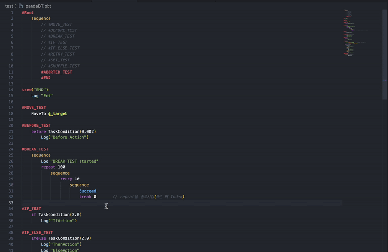

# 🐼 Panda BT 2.0 Helper


[](https://marketplace.visualstudio.com/items?itemName=ryulurala.pandabt-helper)


## Overview

**Panda BT 2.0 Helper**는 [Panda BT 2 (Unity Asset)](https://assetstore.unity.com/packages/tools/behavior-ai/panda-bt-2-274073)를 사용하는 개발자가 Visual Studio Code에서 `.pbt` 파일을 더 편리하게 편집할 수 있도록 만든 확장입니다.

이 확장은 Panda BT 2.0 사용자 경험을 개선하기 위해 직접 개발되었으며, **텍스트 하이라이팅**과 **자동 포맷팅**을 통해 보다 빠르고 일관된 BT 스크립팅 작업을 지원합니다.

## ✨ Features

### ✅ 텍스트 하이라이팅

|            Text Highlighting            |
| :-------------------------------------: |
|  |

- `.pbt` 확장자를 위한 Panda BT 2 전용 하이라이팅 규칙을 제공합니다.
- 커맨드, 태스크, 주석 등의 가독성을 향상시킵니다.

### ✅ 포맷팅 (Format on Save)

|           Text Formatting            |
| :----------------------------------: |
|  |

- VS Code에서 저장 시 자동으로 문서를 포맷합니다.
- 코드 스타일을 일관되게 유지할 수 있습니다.

## 🖥 Requirements

- Visual Studio Code **v1.99.0 이상**
- Node.js **v22.14.0** (Extension 빌드 기준)

## ⚙ Commands

| Command Name                                            | Description                                                                                                                                                                                  |
| ------------------------------------------------------- | -------------------------------------------------------------------------------------------------------------------------------------------------------------------------------------------- |
| `PandaBT Helper: Add Default Template to settings.json` | 개발자가 지정한 기본 색상 설정을 `settings.json`에 추가합니다. 추가된 설정을 수정하여 텍스트 컬러를 수정할 수 있습니다. 또는 해당 규격으로 토큰을 추가해 텍스트의 색상을 추가할 수 있습니다. |

## 🔧 Configuration

설치하면 `settings.json`에 자동으로 아래 설정이 반영됩니다:

```json
{
  "editor.semanticHighlighting.enabled": true,
  "editor.semanticTokenColorCustomizations": {
    "enabled": true,
    "rules": {
      "pbt_tree": {
        "foreground": "#E06C75",
        "fontStyle": "bold"
      },
      "pbt_composite": {
        "foreground": "#E5C07B"
      },
      "pbt_decorator": {
        "foreground": "#BBB7B7"
      },
      "pbt_decorator_abortable": {
        "foreground": "#BBB7B7"
      },
      "pbt_control_condition": {
        "foreground": "#C678DD"
      },
      "pbt_control_iteration": {
        "foreground": "#C678DD"
      },
      "pbt_control_random": {
        "foreground": "#C678DD"
      },
      "pbt_task_status": {
        "foreground": "#61AFEF",
        "fontStyle": "bold"
      },
      "pbt_task_time": {
        "foreground": "#61efe3",
        "fontStyle": "bold"
      },
      "pbt_task_debug": {
        "foreground": "#61ef72",
        "fontStyle": "bold"
      },
      "pbt_task_set": {
        "foreground": "#61ef79",
        "fontStyle": "bold"
      },
      "pbt_task_set_load": {
        "foreground": "#e5ef61",
        "fontStyle": "bold"
      },
      "pbt_task_set_save": {
        "foreground": "#ef9c61",
        "fontStyle": "bold"
      },
      "pbt_string": {
        "foreground": "#A5D6A7"
      },
      "pbt_number": {
        "foreground": "#B39DDB"
      },
      "pbt_comment": {
        "foreground": "#9E9E9E",
        "fontStyle": "italic"
      }
    }
  }
}
```

## 🔧 Customization

아래의 규격으로 tokens에 추가적으로 토큰을 추가해서 색상을 변경할 수 있습니다.

```json
{
  "pandabt-helper.configuration": {
    "version": "0.1.0",
    "tokens": {
      "pbt.tree": {
        "match": "(\\b(tree)\\b|^\\s*#\\w+)",
        "foreground": "#E06C75",
        "fontStyle": "bold"
      },
      "pbt.composite": {
        "match": "\\b(sequence|fallback|parallel|race)\\b",
        "foreground": "#E5C07B"
      }
    }
  }
}
```
